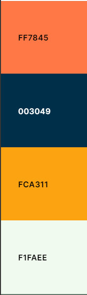

# Kiddie Corner


Welcome to Kiddie Corner, a dynamic Django-powered website designed for effortless toy shopping. Here, users can easily navigate through our extensive collection, tailored for different age groups, ensuring a seamless shopping experience for every visitorThis intuitive interface allows users to explore toys suitable for various ages with ease.

# Table of Contents
- [Planning and Design](#planning-and-design)
    - [Target-Audience](#target-audience)
    - [Project-Goalss](#project-goals)
    - [User Stories and Epics](#user-stories-and-epics)
    - [Wireframes](#wireframes)
    - [Database Schema](#Database-schema)
    - [Typography](#typography)
    - [Colour Pallete](#colour-pallete)
    - [SEO](#seo)
      - [keywords](#keywords)
      - [Robots.txt and sitemap.xml](#Robots.txt-and-sitemap.xml)
    - [E-commeerce  business model](#e-commerce-business-model)
- [Features](#Features)
    - [Navigation Bar](#navigation-bar)
    - [Account Management](#account-management)
    - [Homepage](#homepage)
    - [Footer](#footer)
    - [Products-page](#products-page)
    - [Product-Details-Page](#product-details-page)
    - [Special-Offers](#special-offers)
    - [Shopping-Bag](#shopping-bag)
    - [checkout Page](#checkout-page)
    - [Order Complete](#order-complete)
    - [Favourites](#favourites)
    - [Contact Page](#contactipage)
    - [ Testimonials ](#testimonials)
    - [My Account](#my-account)
    - [Product Management](#product-management)
    - [404-Page not found](#Page-not-found)
    - [ 505-server error](#server-error)
- [Future Development](#future-development)


- [Testing](#testing)
- [Deployment](#dployment)
   - [Heroku Deployment](#heroku-deployment)
   - [ElephantSQL Database](#elephantsql-database)
   - [Forking the Repository](#forking-the-repository)
   - [Cloning The Repository](#cloning-the-repository)
- [Tecnologies used](#technologies-used)
- [Credits](#credits)
- [Acknowledgements](#acknowledgements)

I have included testing details in a separate document called [testing](TESTING.md).

# Planning and desigtn
## Target Audience
- Parents and Guardians
- Family Members and Relatives
- Individuals passionate about toys, collectors, or hobbyists
- Teachers, daycare providers, and educational institutions looking for toys for classrooms or childcare settings.
- Individuals looking for gifts for children's birthdays, holidays, or special occasions

## Project Goals
To develop an innovative and user-friendly online toy store platform that caters to various age groups, offering a curated selection of toys, while providing seamless functionality for both customers and shop owners to browse, shop, and manage products efficiently

## User Stories and Epics

Epic-1  : Work Environment Setup
- As a **developer** I can **install Django and essential libraries**,
so that I can **quickly set up a robust development environment and kickstart my web projects with confidence**..
- As a **developer** I want to **deploy the website on Heroku** so that i can  **test its functionality in a live environment and make the completed site accessible to the public**.
- As a **Developer** i want to **validate my HTML, CSS, Python, and JavaScript code and perform Lighthouse audits to ensure that my web application is compliant with standards, performs well, and provides a good user experience.**

Epic-2 :User Experience
- As a **site user** I want  **to navigate through landing page** so that **i can easily access various sections**
- As a **user** I can **register my account** so that  **I can log in and log out in my account.**
- as a **user** i can **login**  to ** use all features of site**
- As a **user**, I want to  **be able to see a comprehensive list of all products**  so that I can **select the ones I want to buy**
- As a **user**, I want  **to find products by category** so that I **can easily browse and locate items without manually searching through the entire product list**.
- As a **user**, I want to **easily identify special offers** so that I **can make efficient purchasing decisions and take advantage of savings**.
- As a **user**, I want to **view detailed product information** so that I can **check the details and make informed purchase decisions**.
- As a **user**, I want to have ability **view only available products** so that I can **focus on browsing and purchasing items that are currently in stock.**
- As a **user**, I want to **search for products by their name or description** so that I can **quickly find specific items without browsing through all products**.
- as a **user** i can **add Products to Shopping bag**  to **easily manage my selections before purchase**
- as a **user** I want  **to remove an item from my shopping bag**  So that I can **adjust my cart contents before proceeding to checkout**
- as a **user** I want to **view the items in my shopping bag** So that I can **review  my selected items all together**.
- As a  **User** I want to **see the total amount of my purchases** So that I can  **review the cost of my items before completing my order**.
- As a **user**  i want to  **make  checkout  quickly and easily ** so that **I can make a purchase without unnecessary delays**
- as a **user**  i want to get  **feedback about  checkout completition** , so that **Feel confident that the checkout process is finished**
- as a **user** I want to be able to **select the quantity of a product**
So that I can **specify how many of the item I wish to purchase**
- As **user**, I want to **send a message to the staff through a contact form**
so that I can **inquire about products, orders, or other concerns without needing to make a phone call**.
- As a **user**, I want to **remove products from the favorites page** so that I can **manage my favorite products easily and keep the list up-to-date**.
- As a **user**, I want to **add products to my favorites** so that I  **do not spend time looking for favourite products again**.
- As a **registered user,** I want to **access and manage my order details on the My Account page**, so that I can easily **track my purchases, view specific order details, and update my delivery information**.
- As a **registered user,** I want to **update my delivery information** on the My Account page,
so that **my orders are delivered to the correct address**.
- As a **user**, I want to **see testimonials** so that I can **read the experiences  from other customers and feel confident about making a purchase**.


Epic-3 : Staff Management
- as a **staff member** i want **to delete product**  so that I can **remove outdated or unnecessary items from the inventory**.
- as a **staff member** i can  **edit products** So that I can update product details as needed.
- As a **staff member**, I want to **add a product**, So that I can efficiently **manage inventory and streamline the product addition process**.

## Wireframes

 I used [Balsamique](https://balsamiq.com/) to create wireframes for my project.These were adapted and improved upon throughout the development process.The wireframes encompass the main pages of the project, with each page extending the base HTML structure that includes navigation and footer elements.Mainly The wireframes display designs for desktop and mobile views. On mobile  screens, elements are arranged from top to bottom for readability and usability. Tablet screens  resemble the mobile version thats why  I decided not to create separate tablet wireframes. . These wireframes offer a clear visual representation of device differences, with most pages following the desktop layout.

[Home-page-desktop](./docs/wireframes/home-page-desktop.png)

<details>
  <summary>Homepage - Mobile (click to expand)</summary>


</details>

[products-page-desktop](./docs/wireframes/all-products-desktop.png)

<details>
  <summary>allproducts - tablet (click to expand)</summary>


</details>

<details>
  <summary>allproducts - mobile (click to expand)</summary>


</details>


[product-detail-page-desktop](./docs/wireframes/product-detail.png)

<details>
  <summary>product-detail- mobile (click to expand)</summary>


</details>


<details>
  <summary>shopping-bag-mobile (click to expand)</summary>


</details>


<details>
  <summary>checkout-page-mobile (click to expand)</summary>


</details>
  


<details>
  <summary>checkout-success-mobile (click to expand)</summary>


</details>


<details>
  <summary>Favourites-mobile (click to expand)</summary>


</details>


<details>
  <summary>Contact Page (click to expand)</summary>


</details>


<details>
  <summary>Testimonials-Page-Desktop (click to expand)</summary>


</details>

<details>
  <summary>Testimonials-Page-Mobile (click to expand)</summary>


</details>


## SEO
Each page shows an extra title after the store name to assist help with SEO.

### Keywords

The selected keywords are the result of thorough research and analysis, incorporating insights from both keyword research tools and analysis of similar websites in the children's toy industry.  These keywords will effectively target the audience and drive visibility and engagement for my website.
- Started with broad seed keywords such as "children's toys" and "kids toys" to generate initial keyword ideas.
- Used keyword research tools to expand the list by identifying related terms, synonyms, and long-tail variations.
- Narrowed down the list based on relevance, search volume, competition, and alignment with our brand and product offerings. 
  
### Robots.txt and sitemap.xml
Sitemap and robots.txt files have been added to the site's root to help with SEO.
 To ensure that the robots.txt file is recognized as a text file rather than an HTML file within my project, i jhave taken the following steps:
 -  added the URL path at the project level to ensure that the robots.txt file is properly recognized.
 -  Due to the initialization of the template in the path, i had to move the robots.txt file into  templates folder to ensure it functions correctly.

## E-commerce Business Model

 Kiddie Corner is a B2C e-commerce application. Selling directly to consumers means that the site is designed to sell quickly, on impulse, and in smaller quantities.The website is not yet intend to sell to other businesses. For this reason, a large amount of the functionality is focused on the user experience and the ability to purchase products quickly and effectively

## Marketing Strategy

 As a small business Kiddie-Corner has limited budget for marketing.So i use cheaper ways To effectively reach page audience and create a lasting connection with  customers. I decide to  implement two key marketing techniques: a Facebook business page and a newsletter signup form.
  -  Using Facebook to pump out content and drive traffic is the first and most straightforward. The use of paid ads allows the business to target specific demographics and increase brand awareness. The use of social media is also a great way to get feedback from customers and to help with customer service. There is an image of the Facebook page in the features section below and a link to the page here  [Facebook](https://www.facebook.com/profile.php?id=61560273074359). 
  - The second method would then be sending regular news letters to the mailing list obtained via the mailchimp form. The newsletter would contain links to recent articles on  children toys, the latest products and the highly sought after special offers and promotions. This would help with brand awareness building a community around the brand.


## Database Schema

I used [lucid.app](https://lucid.app/) to create database schema for my project .The e-Commerce store  includes seven  models which we can define in 3 categorys:
1. Product Models:
- Category: Organizes products into distinct categories, enhancing navigation and product discovery for users.
- Product: Captures detailed information about each product, including pricing, descriptions, stock status, and user ratings. It also supports user favorites and sale indicators.
2. Purchase Models:
- Order: Manages customer orders, tracking essential details such as customer information, order status, and shipping methods. This ensures efficient order processing.
- OrderLineItem: Allows staff members to make changes to each order by detailing specific products included in the order.
3. Additional Models:
- UserMessage: Facilitates user communication via a contact form.
- UserProfile: Maintains user-specific details, including default delivery addresses and order history, to provide a personalized and better shopping experience.
- Testimonial: Stores customer testimonials, including feedback and optional images, to build credibility and trust in the products and services offered.


## Typography

I utilized a combination of fonts to achieve both aesthetic appeal and optimal readability in this project:

- Lato: Chosen as the primary font, Lato was employed across all pages. Its consistent usage ensures uniformity and clarity throughout the website's interface.

- Schoolbell and Bangers: Given the playful nature of the store, I opted to incorporate these fonts to exude a lively and dynamic essence.

## Colour Pallete



* The color palette was chosen with [coolers](https://coolors.co/) and consists of 4 simple colours as seen above.
A dark bluecolor was chosen for the header and footer backgrounds. These darker tones were complemented by lighter colours such as yellow and orange, imparting  visual interest. Furthermore, a light grey shade was utilized as the background for the body content, providing  optimal readability and user engagement.
Alongside these colors, standard Bootstrap colors are used for buttons, links, and to highlight certain text and messages.
Adapting the above throughout the development process. The final list of colors used has been placed in contasr grid to check contrast scores.


[Back to top](#target-audience)

# Features
## Navigation Bar 
The navigation  bar designed with bootstrap adapts seamlessly to different screen sizes, ensuring a consistent user experience across desktops, tablets, and mobile devices.
The navbar contains the business logo which links back to the homepage when clicked. There is also a Search bar that allows users to query the 'products' database. There are three icon links in the upper right of the navbar that link to the user favourites, user account/account management, and shopping bag features.The Menu Contains links to the Home, About/testimonials, All Products, shop by age, special offers and contuct us pages.


At smaller screen widths, the nav bar collapses into a burger-style dropdown menu to enhance user experience on mobile and tablet devices.


In the main menu, there is a dropdown link titled "Shop by Age" where you can select a specific age category to browse relevant products. When you click on "Shop by Age," a dropdown menu will appear, allowing you to choose the desired age category.After selecting your preferred age category, you will be redirected to a page displaying product categories tailored to the chosen age group. 


Located in the top navigation bar, there is a search bar that allows you to search for products based on their name or description.


## Account Management 
Login/Register/Logout:
 Users can access the account dropdown menu where they have the choice to login or register.

 

  If logged in, the option to logout is available. 

  
 

 
 Upon clicking the register option, users are redirected to the sign-up page.

 

  If the provided email or username already exists, users are notified, and they are prompted to choose a different one.

   

After filling out the required fields and clicking sign up, a confirmation message is displayed indicating that a verification link has been sent to the provided email address.Upon clicking the verification link received via email users are rediurected to the page where they should confirm their email address. 

 

After confirming their email address users are notified that their email has been confirmed, and they can proceed to sign in.

 


 For already registered users, clicking the account dropdown/login link redirects them to the sign-in page where they provide their account details. After filling out the form and clicking sign in, users are logged in, and an appropriate message is displayed confirming their login.
 
 
 

  


To log out, logged in users can click the logout link in the account dropdown menu. They are redirected to the logout page where they confirm their decision. Upon successful logout, a message notifies users that they have been logged out. Each page also includes a cancel button for users to cancel their actions and be redirected to the home page.
 
 
 

  

- More extensive account functionalities were implemented in the previous project (Project 4). To avoid duplicating efforts and to focus on new features, the decision was made to prioritize other aspects of the project while maintaining essential account management capabilities.


## Delivery Banner

The website features a prominent delivery banner positioned at the top of the header section. This banner encourages users to spend more than €50 to qualify for free delivery on their orders.


## Homepage

The home page features a main background image to catch users eye, with a button placed in the middle of the banner. Clicking this button takes user to the All Products page. Below that there is Highlighted Features and under that section there's a section about us with a small description of the page. Additionally, users can find age-specific links that lead to toys tailored for different age groups..


<details>
  <summary>Homepage - Mobile (click to expand)</summary>


</details>

## Footer

The footer of the Kiddie Corner website provides essential information and offers additional ways to connect with the store staff. Users can also subscribe to the newsletter to receive updates and news via email.
 
 Footer is present on all pages. It contains three main sections, and a copyright section at the bottom.

The three sections typical to both desktop and mobile are:

- address and Social Media Links
- Newsletter Sign Up
- Sitemap


 <details>
  <summary>Footer-Mobile (click to expand)</summary>


</details>

 <details>
  <summary>Footer-Mobile (click to expand)</summary>


</details>

I have included a screenshot of the Facebook page in case Facebook decides to remove link because it is not a real business at this stage. [facebook](https://www.facebook.com/profile.php?id=61560273074359)


## Products-Page

When you click on "All Products" in the navigation bar, you will be directed to the product listing page where you can view all available products. Each product entry on this page includes:

- Product Name: Clearly labeled to identify the product.Product Price: Indicating the cost of the product.
- Product Rating: Showing the average rating of the product based on user reviews.
- Stock Status: Displayed to inform users whether the product is in stock or out of stock.
- Product Details Button: Clicking this button allows you to view more detailed information about the product.
- Clickable Image: You can also click directly on the product image to navigate to the product details page.


<details>
  <summary>Products-page- Mobile (click to expand)</summary>


</details>

- If a product is on sale, a small sale mark will be applied to its image to highlight the discounted price.


- If no image is uploaded for a product, a placeholder image will be shown.


Additionally, there is a checkbox option labeled " Available Products Only ". When this checkbox is selected, the product listing will automatically filter to display only those products that are currently in stock and available for purchase. This feature provides users with the convenience of viewing products that they can immediately order.


## Product-Details


Adter clicking the "Product Details" button for any product, you will be directed to the product detail page. On this page,This page offers a comprehensive view of the selected product's details:

- Product Image: The product image is displayed prominently, with a wider view compared to the product listing page.
- Product Information: Detailed information is provided, including the product name, price, SKU  rating and price
- Action Buttons:
  - more products: This button allows you to return to the main products page for further browsing.
  - Add to Bag: Clicking this button adds the product to your shopping bag or cart.
  - Add to Favorites: This button allows you to add the product to your favorites or wishlist.
- Quantity Selection: A dropdown or form is provided to select the desired quantity of the product.


<details>
  <summary>Product-details-Mobile (click to expand)</summary>


</details>


 If the product is out of stock, the quantity selection will be disabled, and the 'Add to Bag' button will be removed to prevent adding out-of-stock items.

 

 ## Special Offers

Clicking on the "Special Offers" link in the main menu will direct you to the Special Offers page. On this page, you will find a curated list of products that are currently on sale.

 

 ## Shopping Bag

 To access the shopping bag page, click on the cart icon located on the top right side of the page.

  

   - Staff Members do not have permission to view shopping bag page or add product to shopping bag.when they try to acces this page/add product to shopping bag , appropriate message will dislay and they will be redirected  to home page.

     

       


After navigating to the shopping bag page, if no items have been added, an appropriate message will be displayed encouraging users to add products to their bag. This message will include a button that directs users to the products page.

  

  
 <details>
  <summary>Empty-Bag-Mobile (click to expand)</summary>


</details>


If there are items in the shopping bag, the page will display all item details including product name, quantity, and price. Users will have the ability to update the quantity or remove items using dedicated buttons. Additionally, there will be a separate section displaying a shopping summary, which includes information about the total cost of items and delivery charges.

 

 <details>
  <summary>Product-details-Mobile (click to expand)</summary>


</details>

When items are added to the shopping bag, approrpaiete message  will be displayed to user, also the color of the navigation cart link will change, indicating that items are present. Additionally, the cart link will display the total price of the items in the bag(for desktop screen)
 


On mobile and tablet screens, the cart icon turns yellow when items are added to the shopping bag.


On the shopping bag page, you can update or remove items using the appropriate buttons. After performing an update or removal, a message will be displayed to inform you of the action taken.


## Checkout Page
When you click on the "Secure Checkout" link on the shopping bag page, you'll be directed to the checkout page. Here, you can complete your purchase by filling out a form with your personal and delivery information, followed by providing your card details. Once you've filled out the necessary information, you can click "Submit Order" to finalize your purchase. Alternatively, you can return to the products page.

If you're authenticated, you have the option to save your information for future purchases. Only logged-in users can avail this feature. Additionally, a small card section displays a summary of your shopping, including the number of items you're purchasing and the total cost, including delivery fees. On the left-hand side(on desktop screen) you'll find images of the items you've selected along with their quantities and prices below.


 <details>
  <summary>Checkout-page-Mobile (click to expand)</summary>


</details>

If you attempt to click the "Secure Checkout" button without having any items in your shopping bag, you will not be able to proceed to the checkout page. Instead, an error message will be displayed to notify you that your shopping bag is empty. You will need to choose items first to continue with your purchase.


after sucessfuly submiting infromation appropriate message wil displayed to let you know that order  confirmation has sent to your email.


If you enter incorrect card numbers or expiry date, an appropriate message will be displayed below the card details section to alert you of the error.


##  Checkout Success

After successfully submitting your order, you'll be redirected to another page where you'll receive a confirmation message indicating that your order has been completed. On this page, you'll find all the relevant information regarding your order.
You have the option to return to the home page by clicking the "Back To Home" button.


 

  <details>
  <summary>Checkout-success-Mobile (click to expand)</summary>


</details>

##  Favourites

- Navigating to the Favorites Page
Accessing the Page: Click the "Favorites" link located on the top navigation bar (second from the top right). This will redirect you to the Favorites page.
Favorites Page Content: On the Favorites page, you will see the products you have marked as favorites. If no products have been added, a text will display indicating that your favorites bag is empty and encouraging you to add products. This message will include a link to the products page.


 <details>
  <summary>Favourites-Mobile (click to expand)</summary>


</details>

  - Staff members are not allowed to add products to favourites page or see the Favourites page itself. When they try to access the page, an appropriate message will notify them, and they will be redirected to the Home page.
    
    

      
    


- Adding Products to Favorites
 On the product detail page, you can choose to add the product to your favorites with "Add To Favourites" Button. A message will notify you that the product has been added to the Favorites page.
Duplicate Favorites: If the product is already in your favorites, you will not be able to add it again. A message will notify you that the product is already in your favorites.


- Managing Products on the Favorites Page
  - Adding to Bag: From the Favorites page, you can add a product to your bag with "Add To Bag" button if it is in stock. A message will notify you that the product has been added to your shopping bag, similar to the notification on the Shopping Bag page.There wil be also Button which navigates to favourites page.

  

   - Removing Items: You can also remove items from your favorites with "REMOVE" button. An appropriate message will notify you that the item has been removed from your favorites.WIth  button which navigates to  favourites page.


When a user removes the last item from their favorites page, a message will be displayed indicating that the item has been removed. If there are items in the shopping bag, an additional message will be shown below, encouraging the user to proceed to the shopping bag and complete their purchase.


## Contact Page
Users can contact the staff through the contact page. You can navigate to this page by clicking on the "Contact Us" link in the main navigation bar. On the contact page, there are fields to enter your name, email address, subject, and a text area for your message. You can send your message by clicking the "Send Message" button or cancel the message by clicking "Go Back," which will redirect you to the previous page. 


<details>
  <summary>Favourites-Mobile (click to expand)</summary>

  

</details>

After successfully sending the message, a notification will display, informing you that your message has been sent and that a staff member will contact you through the email address you provided.


## Testimonials
The Testimonials page can be accessed via the navigation bar. When you click on the "About" dropdown link, you can select "Testimonials" to navigate to the testimonials page.

Testimonials are displayed in a carousel format, allowing users to browse through them easily. Each testimonial card includes the user's name, profession, image, and testimonial text. You can navigate to the next or previous testimonial by clicking the arrow buttons or using the keyboard arrow keys.


  

  <details>
  <summary>testimonial-Mobile (click to expand)</summary>

  

</details>

## My Account
Registered users can access their profile page to check order details or update delivery informations by following these steps:
Click on the user icon in the navigation bar. This will open a dropdown menu.
- If You Are a Registered User:
Select "My Account" from the dropdown menu to go to your profile page.
- If You Are Not Registered:
You can register an account from the dropdown menu options.
- If you are logged in, you can log out from the site using the logout  link provided in the dropdown menu.


  

Once you are on your account page, you can manage your previous orders:


- All your previous orders will be listed on your account page.
View Order Details:

- Click on the order number to be redirected to the checkout_success page, where you can see the specific details of the order.


  

  <details>
  <summary>profile-Mobile (click to expand)</summary>

  

</details>

- Click "Update Information" to update your delivery details.
After successfully updating, a message will be displayed to notify you that the information was updated.


## Product Management

- Add Product

If a staff member is logged in, they have the ability to go to the Product Management page by clicking the account dropdown link and selecting Product Management. This redirects them to the Add Product page, where staff members can add products.


  <details>
  <summary>add-product-mobile (click to expand)</summary>

  

</details>

If the product is added successfully, an appropriate success message will be displayed.


If there is any error during the product addition process, an appropriate error message will be displayed.


- Edit Product

On the Product Detail and on the Products page, each product has the ability to be edited or deleted (only for staff members). When a staff member clicks Edit, they will be redirected to the same page as the Add Product page, where staff members can change product details. 


 


  <details>
  <summary>edit-product-mobile (click to expand)</summary>

  

</details>

If the update is successful, an appropriate message will display.


If there is any error during the product edit process, an appropriate error message will be displayed.


- Delete Product

A staff member can delete a product by simply clicking on the Delete link on the Product Detail or Products page. When the product is deleted, the staff member will be notified by a success message.


  - If anyone other than staff members attempts to access the add/edit/delete/pages functionality, they will be redirected to the home page and presented with an appropriate message indicating that access is restricted.


## 404  Page not Found Page
This error shows when a user types a URL into the browser which does not exist within the app's domain.


# Future Development

Despite the pressing deadlines, it was not possible to implement all  features within the current project.i In future updates, i plan to incorporate the following user stories :

Add Testimonials
Introduce the ability for staff members to add testimonials directly from the product management page. 

Social Media  Verification
Integrate social media account sign-in functionality for easy  login process for users. This will allow users to sign in to their accounts using their preferred social media platforms.

Display Product Quantity
Implement a feature that displays the remaining quantity of each product in stock, providing users with real-time information about product availability. This will empower users to make informed purchasing decisions based on current stock levels.

Reset Password
Introduce a password reset functionality for registered users, allowing them to easily reset their passwords in case they forget them. 


## Testing

I have included testing details in a separate document called  [Testing](TESTING.md)

## Deployment

### Heroku Deployment

The project was deployed using [Heroku](https://id.heroku.com/login).

After account setup, deployment steps are as follows:

1. Select **New** in the top-right corner of your Heroku Dashboard, and select **Create new app** from the dropdown menu.
2. App name must be unique, and then choose a region closest to you (EU or USA), and finally, select **Create App**.
3. Navigate to the settings tab and click **Reveal config vars**  and add the config vars necessary for the project:                       
 `DATABASE_URL`           (insert your own ElephantSQL database URL ) 
 `DISABLE_COLLECTSTATIC`  1 (temporary) 
 `SECRET_KEY`             (random secret key )                                  
 
Also make sure you create Procfile and requirements.txt file.

4. Navigate to the **Deploy** section by clicking the "Deploy" tab in the navbar, Select **GitHub** as the deployment method and click **Connect to GitHub**.
5. Find the repository wehich you want to deploy and click on **connect**.
6. Find button **Deploy Branch** at the bottom of page.
7. After clicking **Deploy Branch** button it will take few minutes to deploy site and you will have ability to view it  clicking on **view** button.


### **AWS S3 Bucket**

The below works on the assumption that you already have an account with [AWS](https://signin.aws.amazon.com/signin?redirect_uri=https%3A%2F%2Fus-east-1.console.aws.amazon.com%2Fconsole%2Fhome%3FhashArgs%3D%2523%26isauthcode%3Dtrue%26nc2%3Dh_ct%26region%3Dus-east-1%26skipRegion%3Dtrue%26src%3Dheader-signin%26state%3DhashArgsFromTB_us-east-1_5ebca9aa1f981aaf&client_id=arn%3Aaws%3Asignin%3A%3A%3Aconsole%2Fcanvas&forceMobileApp=0&code_challenge=tXaJuB6g7gFkIttyTd75shZNQrYlt0B3-zdaKPesuQI&code_challenge_method=SHA-256) and are already signed in.

1. Create a new S3 bucket:
    * Click "Services" in the top left-hand corner of the landing page, click on "Storage" then click "S3."
    * Click "Create bucket."
    * Give the bucket a unique name:
        * Will form part of the URL (in the case of this project, I called the S3 bucket pp5-vapeshop)
    * Select the nearest location:
        * For me, this was EU (Frankfurt) eu-central-1.
    * Under the "Object Ownership" section, select "ACLS enabled"
    * Under the "Block Public Access settings for this bucket" section, untick "Block all public access" and tick the box to acknowledge that this will make the bucket public.
    * Click "Create bucket."
1. Amend Bucket settings:
    * Bucket Properties: -
       * Click on the bucket name to open the bucket.
       * Click on the "Properties" tab.
       * Under the "Static website hosting" section, click "Edit."
       * Under the "Static website hosting" section select "Enable".
       * Under the "Hosting type" section ensure "Host a static website" is selected.
       * Under the "Index document" section enter "index.html".
       * Click "Save changes."
    * Bucket Permissions: -
       * Click on the "Permissions" tab.
       * Scroll down to the "CORS configuration" section and click edit.
       * Enter the following snippet into the text box:

       ```JSON
            [
                {
                    "AllowedHeaders": [
                    "Authorization"
                    ],
                    "AllowedMethods": [
                    "GET"
                    ],
                    "AllowedOrigins": [
                    "*"
                    ],
                    "ExposeHeaders": []
                }
            ]
        ```

       * Click "Save changes."
       * Scroll back up to the "Bucket Policy" section and click "Edit."
       * Take note of the "Bucket ARN" click on the "Policy Generator" button to open the AWS policy generator in a new tab.
       * In the newly opened tab under Step 1 "Select Policy Type" select "S3 Bucket Policy." from the drop down menu.
       * Under Step 2 "Add Statement(s)" enter " * " in the "Principal" text box.
       * From the "s3:Action" drop down menu select "s3:GetObject".
       * Enter the "ARN" noted from the bucket policy page into the "Amazon Resource Name (ARN)" text box.
       * Click "Add Statement."
       * Under Step 3 "Generate Policy" click "Generate Policy."
       * Copy the resultant policy and paste it into the bucket policy text box on the previous tab.
       * In the same text box add "/*" to the end of the resource key to allow access to all resources in this bucket.
       * Click "Save changes."
       * When back on the buckets permissions tab, scroll down to the "Access Control List" section and click "Edit."
       * enable "List" for "Everyone (public access)", tick the box to accept that "I understand the effects of these changes on my objects and buckets."  and click "Save changes."

1. Create AWS static files User and assign to S3 Bucket:
    * Create "User Group": -
        * Click "Services" in the top left-hand corner of the landing page, from the left side of the menu click on "Security, Identity, & Compliance" and select "IAM" from the right side of the menu.
        * Under "Access management" click "User Groups."
        * Click "Create Group."
        * Enter a user name (in the case of this project, I called the user group "manage-pp5-vapeshop").
        * Scroll to the bottom of the page and click "Create Group."
    * Create permissions policy for the new user group: -
        * Click "Policies" in the left-hand menu.
        * Click "Create Policy."
        * Click "Import managed policy."
        * Search for "AmazonS3FullAccess", select this policy, and click "Import".
        * Click "JSON" under "Policy Document" to see the imported policy
        * Copy the bucket ARN from the bucket policy page and paste it into the "Resource" section of the JSON snippet. Be sure to remove the default value of the resource key ("*") and replace it with the bucket ARN.
        * Copy the bucket ARN a second time into the "Resource" section of the JSON snippet. This time, add "/*" to the end of the ARN to allow access to all resources in this bucket.
        * Click "Next: Tags."
        * Click "Next: Review."
        * Click "Review Policy."
        * Enter a name for the policy (in the case of this project, I called the policy "pp5-vapeshop-policy").
        * Enter a description for the policy.
        * Click "Create Policy."
    * Attach Policy to User Group: -
        * Click "User Groups" in the left-hand menu.
        * Click on the user group name created during the above step.
        * Select the "Permissions" tab.
        * click "Attach Policy."
        * Search for the policy created during the above step, and select it.
        * Click "Attach Policy."
    * Create User: -
        * Click "Users" in the left-hand menu.
        * Click "Add user."
        * Enter a "User name" (in the case of this project, I called the user "pp5-vapeshop-staticfiles-user").
        * Select "Programmatic access" and "AWS Management Console access."
        * Click "Next: Permissions."
        * Select "Add user to group."
        * Select the user group created during the above step.
        * Click "Next: Tags."
        * Click "Next: Review."
        * Click "Create user."
        * Take note of the "Access key ID" and "Secret access key" as these will be needed to connect to the S3 bucket.
        * Click "Download .csv" to download the credentials.
        * Click "Close."

1. Install required packages to used AWS S3 Bucket in Django:
    * ```pip install boto3```
    * ```pip install django-storages```
1. Add 'storages' to the bottom of the installed apps section of settings.py file:

   ```python
    INSTALLED_APPS = [
    …,
        'storages'
    …,
   ]
   ```
   1. Link S3 Bucket to Django Project by adding the following to the settings.py file:

    ``` python
        # its important to keep the AWS keys secret so we use environment variables which will be added to Heroku later
        # Cache control
        AWS_S3_OBJECT_PARAMETERS = {
           'Expires': 'Thu, 31 Dec 2099 20:00:00 GMT',
           'CacheControl': 'max-age=94608000',
        }
        # Bucket config
        AWS_STORAGE_BUCKET_NAME = '{Bucket name}' # name of your bucket
        AWS_S3_REGION_NAME = '{Region name}' # region of your bucket
        AWS_ACCESS_KEY_ID = os.environ.get('AWS_ACCESS_KEY_ID')
        AWS_SECRET_ACCESS_KEY = os.environ.get('AWS_SECRET_ACCESS_KEY')
        AWS_S3_CUSTOM_DOMAIN = f'{AWS_STORAGE_BUCKET_NAME}.s3.amazonaws.com'

        # Static and media files
        STATICFILES_STORAGE = 'custom_storages.StaticStorage'
        STATICFILES_LOCATION = 'static'
        DEFAULT_FILE_STORAGE = 'custom_storages.MediaStorage'
        MEDIAFILES_LOCATION = 'media'

        # Override static and media URLs in production
        STATIC_URL = f'https://{AWS_S3_CUSTOM_DOMAIN}/{STATICFILES_LOCATION}/'
        MEDIA_URL = f'https://{AWS_S3_CUSTOM_DOMAIN}/{MEDIAFILES_LOCATION}/'
    ```
## Stripe

* Open a [Stripe](https://dashboard.stripe.com/register) Account

* Log in and click on 'Developers

* Navigate to API keys

* Copy the the publishable and secret keys

Back in the Developers section on Stripe stripe navigate to webhooks and click create endpoint.

Create a webhook for all events in Stripe and save the key

* Add the webhook key to your environment variables and test using the Stripe events log.


###  ElephantSQL Database

This project uses [ElephantSQL](https://www.elephantsql.com) for the PostgreSQL Database.

To set up a database, please follow these steps:

1. Sign up or log in to ElephantSQL with your GitHub account.
2. Click on **Create New Instance**.
3. Enter a name for the instance.(project name)
4. Select **Tiny Turtle (Free)** free plan.
5. The "Tags" field can be left blank.
6. Click **Select Region**.
7. Select a data center near you.
8. Click **Review**, make sure that all details are correct and then click "Create instance".
9. Once created, click on the new database name, where you can view the database URL and Password.


### Cloning the Repository

This project can be cloned or forked in order to make a local copy on your own system.

For either method, you will need to install any applicable packages found within the _requirements.txt_ file.

You can clone the repository by following these steps:

1. Go to the [GitHub repository](https://github.com/tamariam/Kiddie-Corner)
2. Locate the Code button above the list of files and click it
3. Select if you prefer to clone using HTTPS, SSH, or GitHub CLI and click the copy button to copy the URL to your clipboard
4. Open Git Bash or Terminal
5. Change the current working directory to the one where you want the cloned directory
6. In your IDE Terminal, type the following command to clone my repository:
  `git clone https://github.com/tamariam/Kiddie-Corner`  then press Enterr.

### Forking the Repository

To create a copy of the repository for viewing and editing without affecting the original repository you can fork the repository through the following steps:

1. In my repository[github repository](https://github.com/tamariam/restaurant-Tamariam) click on the "fork" tab in the top right corner.
2. Then click **create fork**  and it will fork the repository in your github account.


# **Technologies used**

* Python
  * The packages installed for the is project can be found in [the requirements.txt](requirements.txt)
* Django
  * Django was used as the python framework in the project.
  * Django all auth was used to handle user authentication and related tasks i.e. sign in, sign up, sign out.
* Heroku
  * Used to deploy the page and make it publicly available.
* ElephantSQL
  * Used for the database during development and in deployment.
* HTML
  * HTML was the base language used to layout the skeleton of all templates.
* CSS
  * Custom CSS used to style the page and make the appearance look a little more unique.
* Javascript
  * I have used JavaScript to automatically hide displayed messages after a few seconds.
* Bootstrap(vesrion 4.4.1 )
  * Used to style HTML and CSS
* Font Awesome
  * All icons throughout the page.
* Stripe
 * Kiddie Corner utilised Stripe to manage secure payments
* JavaScript 
  * was used to implement interactivity and manipulatethe DOM from the front end.


  # Credits
*  Boutique Ado
 * Many elements of the the e-commerce part of this project have been adapted from the Code Institute's "Boutique Ado" Code-through Project.
* [Balsamiq](https://balsamiq.com/wireframes/) was used to create the wireframes.
* [lucid.app](https://lucid.app/users/login#/login) was used to create ERD
* The site was developed using [gitpod](https://www.gitpod.io/).
* [GitHub](https://github.com/) was used to store my repository.
* [gitpod](https://www.gitpod.io/) was used as the primary development enviroment.
* Responsive screenshot made using [amiresponsive.com](https://ui.dev/amiresponsive)
* [Article on writing good user stories](https://www.industriallogic.com/blog/as-a-developer-is-not-a-user-story/)
* [coolers.co](https://coolors.co/603f3f-a0acca-e4b67c-de9f13-000000) was used to generate color scheme.
* [eightshapes-contast grid](https://contrast-grid.eightshapes.com/) to check contrast of colours.
* Fonts were taken from [Google Fonts](https://fonts.google.com/)
* Images:
  * for all images used for site  taken from [pixels.com](https://www.pexels.com/) 
  * Tiny PNG to resizing larger image files
* Multiple videos sourced from youtube :
    * [django-wednesdays](https://www.youtube.com/watch?v=HHx3tTQWUx0&list=PLCC34OHNcOtqW9BJmgQPPzUpJ8hl49AGy)
    * [Learn Django - Class-Based Views series](https://youtu.be/ScteNE1jB4g)
* General references:
    * [Stack Overflow](https://stackoverflow.com/)
    * [Code Institute Learning Platform](https://codeinstitute.net/)
    * [Django Documentation](https://docs.djangoproject.com/en/3.2/)
    * [Bootstrap Documentation](https://getbootstrap.com/)
    * AI to generate description text for products.

# Acknowledgements

This site was developed as a final portfolio project for the [Code Institute](https://codeinstitute.net/global/) course in Full Stack Software Development. I would like to thank the following for all of the support throughout the development phase.

* The Code Institute community, including Tutor Support, Student Care and the Slack Community.
* My mentor, [David Bowers](https://www.linkedin.com/in/dnlbowers/) for providing me with advice throughout the development process.