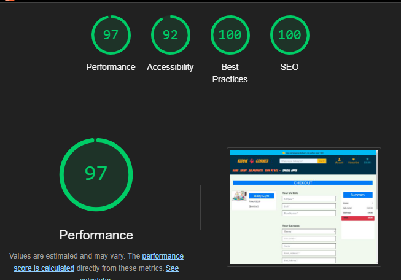
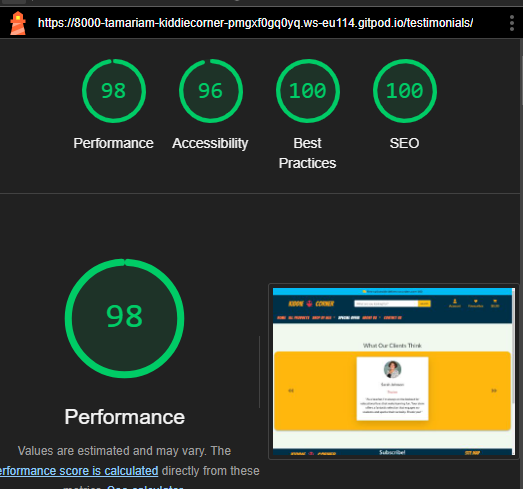

# Kiddie Corner

Welcome to Kiddie Corner, a dynamic Django-powered website designed for effortless toy shopping. Here, users can easily navigate through our extensive collection, tailored for different age groups, ensuring a seamless shopping experience for every visitorThis intuitive interface allows users to explore toys suitable for various ages with ease.

# Table of Contents
- [Planning and Design](#planning-and-design)
    - [Target-Audience](#target-audience)
    - [Project-Goalss](#project-goals)
    - [User Stories and Epics](#user-stories-and-epics)
    - [Wireframes](#wireframes)
    - [Database Schema](#Database-schema)
    - [Typography](#typography)
    - [Colour Pallete](#colour-pallete)
- [Features](#Features)
    - [Navigation Bar](#navigation-bar)
    - [Homepage](#homepage)
    - [Products-page](#products-page)
    - [Product-Details-Page](#product-details-page)
    - [Special-Offers](#special-offers)
    - [Shopping-Bag](#shopping-bag)
    - [checkout Page](#checkout-page)
    - [Order Complete](#order-complete)
    - [Favourites](#favourites)
    - [Contact Page](#contactipage)
    - [ Testimonials ](#testimonials)
    - [My Account](#my-account)
    - [Footer](#footer)

- [Testing](#testing)
    - [lighthouse](#lighthouse)
- [Deployment](#dployment)
   - [Heroku Deployment](#heroku-deployment)
   - [ElephantSQL Database](#elephantsql-database)
   - [Forking the Repository](#forking-the-repository)
   - [Cloning The Repository](#cloning-the-repository)
- [Tecnologies used](#technologies-used)
- [Credits](#credits)
- [Acknowledgements](#acknowledgements)

I have included testing details in a separate document called [testing](TESTING.md).

# Planning and desigtn
## Target Audience
- Parents and Guardians
- Family Members and Relatives
- Individuals passionate about toys, collectors, or hobbyists
- Teachers, daycare providers, and educational institutions looking for toys for classrooms or childcare settings.
- Individuals looking for gifts for children's birthdays, holidays, or special occasions

## Project Goals
To develop an innovative and user-friendly online toy store platform that caters to various age groups, offering a curated selection of toys, while providing seamless functionality for both customers and shop owners to browse, shop, and manage products efficiently

## User Stories and Epics

-  As a **site user** I want  **to navigate through landing page** so that **i can easily access various sections**

## Wireframes
[Home-page-desktop](./docs/wireframes/home-page-desktop.png)

  
Homepage - Mobile (click to expand)

[products-page-desktop](./docs/wireframes/all-products-desktop.png)

  
allproducts - tablet (click to expand)

  
allproducts - mobile (click to expand)

[product-detail-page-desktop](./docs/wireframes/product-detail.png)

  
product-detail- mobile (click to expand)

  
shopping-bag-mobile (click to expand)

  
checkout-page-mobile (click to expand)

  

  
checkout-success-mobile (click to expand)

  
Favourites-mobile (click to expand)

  
Contact Page (click to expand)

  
Testimonials-Page-Desktop (click to expand)

  
Testimonials-Page-Mobile (click to expand)

## Database Schema

## Typography

## Colour Pallete

# Features
## Navigation Bar 
The navigation  bar designed with bootstrap adapts seamlessly to different screen sizes, ensuring a consistent user experience across desktops, tablets, and mobile devices.
The navbar contains the business logo which links back to the homepage when clicked. There is also a Search bar that allows users to query the 'products' database. There are three icon links in the upper right of the navbar that link to the user favourites, user account/account management, and shopping bag features.The Menu Contains links to the Home, About/testimonials, All Products, shop by age, special offers and contuct us pages.

At smaller screen widths, the nav bar collapses into a burger-style dropdown menu to enhance user experience on mobile and tablet devices.

In the main menu, there is a dropdown link titled "Shop by Age" where you can select a specific age category to browse relevant products. When you click on "Shop by Age," a dropdown menu will appear, allowing you to choose the desired age category.After selecting your preferred age category, you will be redirected to a page displaying product categories tailored to the chosen age group. 

Located in the top navigation bar, there is a search bar that allows you to search for products based on their name or description.

## Delivery Banner

The website features a prominent delivery banner positioned at the top of the header section. This banner encourages users to spend more than €50 to qualify for free delivery on their orders.

## Homepage

The home page features a main background image to catch users eye, with a button placed in the middle of the banner. Clicking this button takes user to the All Products page. Below that there is Highlighted Features and under that section there's a section about us with a small description of the page. Additionally, users can find age-specific links that lead to toys tailored for different age groups..

  
Homepage - Mobile (click to expand)

## Products-Page

When you click on "All Products" in the navigation bar, you will be directed to the product listing page where you can view all available products. Each product entry on this page includes:

- Product Name: Clearly labeled to identify the product.Product Price: Indicating the cost of the product.
- Product Rating: Showing the average rating of the product based on user reviews.
- Stock Status: Displayed to inform users whether the product is in stock or out of stock.
- Product Details Button: Clicking this button allows you to view more detailed information about the product.
- Clickable Image: You can also click directly on the product image to navigate to the product details page.

  
Products-page- Mobile (click to expand)

- If a product is on sale, a small sale mark will be applied to its image to highlight the discounted price.

- If no image is uploaded for a product, a placeholder image will be shown.

Additionally, there is a checkbox option labeled " Available Products Only ". When this checkbox is selected, the product listing will automatically filter to display only those products that are currently in stock and available for purchase. This feature provides users with the convenience of viewing products that they can immediately order.

## Product-Details

Adter clicking the "Product Details" button for any product, you will be directed to the product detail page. On this page,This page offers a comprehensive view of the selected product's details:

- Product Image: The product image is displayed prominently, with a wider view compared to the product listing page.
- Product Information: Detailed information is provided, including the product name, price, SKU  rating and price
- Action Buttons:
  - more products: This button allows you to return to the main products page for further browsing.
  - Add to Bag: Clicking this button adds the product to your shopping bag or cart.
  - Add to Favorites: This button allows you to add the product to your favorites or wishlist.
- Quantity Selection: A dropdown or form is provided to select the desired quantity of the product.

  
Product-details-Mobile (click to expand)

 If the product is out of stock, the quantity selection will be disabled, and the 'Add to Bag' button will be removed to prevent adding out-of-stock items.

 

 ## Special Offers

Clicking on the "Special Offers" link in the main menu will direct you to the Special Offers page. On this page, you will find a curated list of products that are currently on sale.

 

 ## Shopping Bag

 To access the shopping bag page, click on the cart icon located on the top right side of the page.

  

After navigating to the shopping bag page, if no items have been added, an appropriate message will be displayed encouraging users to add products to their bag. This message will include a button that directs users to the products page.

  

  
 

  
Empty-Bag-Mobile (click to expand)

If there are items in the shopping bag, the page will display all item details including product name, quantity, and price. Users will have the ability to update the quantity or remove items using dedicated buttons. Additionally, there will be a separate section displaying a shopping summary, which includes information about the total cost of items and delivery charges.

 

 

  
Product-details-Mobile (click to expand)

When items are added to the shopping bag, approrpaiete message  will be displayed to user, also the color of the navigation cart link will change, indicating that items are present. Additionally, the cart link will display the total price of the items in the bag(for desktop screen)
 
 

On mobile and tablet screens, the cart icon turns yellow when items are added to the shopping bag.

On the shopping bag page, you can update or remove items using the appropriate buttons. After performing an update or removal, a message will be displayed to inform you of the action taken.

## Checkout Page
When you click on the "Secure Checkout" link on the shopping bag page, you'll be directed to the checkout page. Here, you can complete your purchase by filling out a form with your personal and delivery information, followed by providing your card details. Once you've filled out the necessary information, you can click "Submit Order" to finalize your purchase. Alternatively, you can return to the products page.

If you're authenticated, you have the option to save your information for future purchases. Only logged-in users can avail this feature. Additionally, a small card section displays a summary of your shopping, including the number of items you're purchasing and the total cost, including delivery fees. On the left-hand side(on desktop screen) you'll find images of the items you've selected along with their quantities and prices below.

 

  
Checkout-page-Mobile (click to expand)

If you attempt to click the "Secure Checkout" button without having any items in your shopping bag, you will not be able to proceed to the checkout page. Instead, an error message will be displayed to notify you that your shopping bag is empty. You will need to choose items first to continue with your purchase.

after sucessfuly submiting infromation appropriate message wil displayed to let you know that order  confirmation has sent to your email.

If you enter incorrect card numbers or expiry date, an appropriate message will be displayed below the card details section to alert you of the error.

##  Checkout Success

After successfully submitting your order, you'll be redirected to another page where you'll receive a confirmation message indicating that your order has been completed. On this page, you'll find all the relevant information regarding your order.
You have the option to return to the home page by clicking the "Back To Home" button.

 

  

  
Checkout-success-Mobile (click to expand)

##  Favourites

- Navigating to the Favorites Page
Accessing the Page: Click the "Favorites" link located on the top navigation bar (second from the top right). This will redirect you to the Favorites page.
Favorites Page Content: On the Favorites page, you will see the products you have marked as favorites. If no products have been added, a text will display indicating that your favorites bag is empty and encouraging you to add products. This message will include a link to the products page.

 

  
Favourites-Mobile (click to expand)

- Adding Products to Favorites
 On the product detail page, you can choose to add the product to your favorites with "Add To Favourites" Button. A message will notify you that the product has been added to the Favorites page.
Duplicate Favorites: If the product is already in your favorites, you will not be able to add it again. A message will notify you that the product is already in your favorites.

- Managing Products on the Favorites Page
  - Adding to Bag: From the Favorites page, you can add a product to your bag with "Add To Bag" button if it is in stock. A message will notify you that the product has been added to your shopping bag, similar to the notification on the Shopping Bag page.There wil be also Button which navigates to favourites page.

  

   - Removing Items: You can also remove items from your favorites with "REMOVE" button. An appropriate message will notify you that the item has been removed from your favorites.WIth  button which navigates to  favourites page.

When a user removes the last item from their favorites page, a message will be displayed indicating that the item has been removed. If there are items in the shopping bag, an additional message will be shown below, encouraging the user to proceed to the shopping bag and complete their purchase.

## Contact Page
Users can contact the staff through the contact page. You can navigate to this page by clicking on the "Contact Us" link in the main navigation bar. On the contact page, there are fields to enter your name, email address, subject, and a text area for your message. You can send your message by clicking the "Send Message" button or cancel the message by clicking "Go Back," which will redirect you to the previous page. 

  
Favourites-Mobile (click to expand)

  

After successfully sending the message, a notification will display, informing you that your message has been sent and that a staff member will contact you through the email address you provided.

## Testimonials
The Testimonials page can be accessed via the navigation bar. When you click on the "About" dropdown link, you can select "Testimonials" to navigate to the testimonials page.

Testimonials are displayed in a carousel format, allowing users to browse through them easily. Each testimonial card includes the user's name, profession, image, and testimonial text. You can navigate to the next or previous testimonial by clicking the arrow buttons or using the keyboard arrow keys.

  

  

  
testimonial-Mobile (click to expand)

  

## My Account
Registered users can access their profile page to check order details or update delivery informations by following these steps:
Click on the user icon in the navigation bar. This will open a dropdown menu.
- If You Are a Registered User:
Select "My Account" from the dropdown menu to go to your profile page.
- If You Are Not Registered:
You can register an account from the dropdown menu options.
- If you are logged in, you can log out from the site using the logout  link provided in the dropdown menu.

  

Once you are on your account page, you can manage your previous orders:

- All your previous orders will be listed on your account page.
View Order Details:

- Click on the order number to be redirected to the checkout_success page, where you can see the specific details of the order.

  

  

  
profile-Mobile (click to expand)

  

- Click "Update Information" to update your delivery details.
After successfully updating, a message will be displayed to notify you that the information was updated.

## Footer

# Testing
## Lighthouse

### Lighthouse testing

[Chrome DevTools Lighthouse](https://developers.google.com/web/tools/lighthouse) was used to test:

* Performance
* Accessibility
* Best Practices
* SEO.

Below are the Lighthouse test results for all pages

  
lighthouse-Testing-Home-Desktop (click to expand)

  
lighthouse-Testing-Home-Mobile (click to expand)

  
lighthouse-testing-Allproducts-desktop (click to expand)

  
lighthouse-Testing-AllProducts-Mobile (click to expand)

  
lighthouse-Testing-product-details-Desktop (click to expand)

  
lighthouse-Testing-product-details-mobile (click to expand)

  
lighthouse-Testing-shop-by-age-desktop (click to expand)

  
lighthouse-Testing-shop-by-age-mobile (click to expand)

  
lighthouse-Testing-special-offers-Desktop (click to expand)

  
lighthouse-Testing-special-offers-Mobile (click to expand)

  
lighthouse-Testing-shopping-bag-Mobile (click to expand)

  
lighthouse-Testing-shopping-bag-Mobile (click to expand)

  
lighthouse-Testing-Empty-Bag-Desktop (click to expand)

  
lighthouse-Testing-Empty-Bag-Mobile (click to expand)

  
lighthouse-Testing-checkout-page-Desktop (click to expand)

  
lighthouse-Testing-checkout-page-Mobile (click to expand)

  
lighthouse-Testing-checkout-success-desktop (click to expand)

  
lighthouse-Testing-checkout-success-Mobile (click to expand)

  
lighthouse-Testing-Favourites-Desktop(click to expand)

  
lighthouse-Testing-Favourites-Mobile(click to expand)

  
lighthouse-Testing-contact-page-Mobile(click to expand)

  
lighthouse-Testing-contact-page-Desktop(click to expand)

  
lighthouse-Testing-Testimonials-page-Desktop(click to expand)

  
lighthouse-Testing-Testimonials-page-Mobile(click to expand)

  
lighthouse-Testing-Profile-page-Mobile(click to expand)

  
lighthouse-Testing-Profile-page-Desktop(click to expand)

## Deployment

### Heroku Deployment

The project was deployed using [Heroku](https://id.heroku.com/login).

After account setup, deployment steps are as follows:

1. Select **New** in the top-right corner of your Heroku Dashboard, and select **Create new app** from the dropdown menu.
2. App name must be unique, and then choose a region closest to you (EU or USA), and finally, select **Create App**.
3. Navigate to the settings tab and click **Reveal config vars**  and add the config vars necessary for the project:                       
 `DATABASE_URL`           (insert your own ElephantSQL database URL ) 
 `DISABLE_COLLECTSTATIC`  1 (temporary) 
 `SECRET_KEY`             (random secret key )                                  
 
Also make sure you create Procfile and requirements.txt file.

4. Navigate to the **Deploy** section by clicking the "Deploy" tab in the navbar, Select **GitHub** as the deployment method and click **Connect to GitHub**.
5. Find the repository wehich you want to deploy and click on **connect**.
6. Find button **Deploy Branch** at the bottom of page.
7. After clicking **Deploy Branch** button it will take few minutes to deploy site and you will have ability to view it  clicking on **view** button.

###  ElephantSQL Database

This project uses [ElephantSQL](https://www.elephantsql.com) for the PostgreSQL Database.

To set up a database, please follow these steps:

1. Sign up or log in to ElephantSQL with your GitHub account.
2. Click on **Create New Instance**.
3. Enter a name for the instance.(project name)
4. Select **Tiny Turtle (Free)** free plan.
5. The "Tags" field can be left blank.
6. Click **Select Region**.
7. Select a data center near you.
8. Click **Review**, make sure that all details are correct and then click "Create instance".
9. Once created, click on the new database name, where you can view the database URL and Password.

### Cloning the Repository

This project can be cloned or forked in order to make a local copy on your own system.

For either method, you will need to install any applicable packages found within the _requirements.txt_ file.

You can clone the repository by following these steps:

1. Go to the [GitHub repository](https://github.com/tamariam/restaurant-Tamariam)
2. Locate the Code button above the list of files and click it
3. Select if you prefer to clone using HTTPS, SSH, or GitHub CLI and click the copy button to copy the URL to your clipboard
4. Open Git Bash or Terminal
5. Change the current working directory to the one where you want the cloned directory
6. In your IDE Terminal, type the following command to clone my repository:
  `git clone https://github.com/tamariam/restaurant-Tamariam`  then press Enterr.

### Forking the Repository

To create a copy of the repository for viewing and editing without affecting the original repository you can fork the repository through the following steps:

1. In my repository[github repository](https://github.com/tamariam/restaurant-Tamariam) click on the "fork" tab in the top right corner.
2. Then click **create fork**  and it will fork the repository in your github account.

# **Technologies used**

* Python
  * The packages installed for the is project can be found in [the requirements.txt](requirements.txt)
* Django
  * Django was used as the python framework in the project.
  * Django all auth was used to handle user authentication and related tasks i.e. sign in, sign up, sign out.
* Heroku
  * Used to deploy the page and make it publicly available.
* Heroku PostgreSQL
  * Used for the database during development and in deployment.
* HTML
  * HTML was the base language used to layout the skeleton of all templates.
* CSS
  * Custom CSS used to style the page and make the appearance look a little more unique.
* Javascript
  * I have used JavaScript to automatically hide displayed messages after a few seconds.
* Bootstrap 5.0.1
  * Used to style HTML and CSS
* Font awesome
  * All icons throughout the page.

  # Credits

* [Balsamiq](https://balsamiq.com/wireframes/) was used to create the wireframes.
* [lucid.app](https://lucid.app/users/login#/login) was used to create ERD
* The site was developed using [gitpod](https://www.gitpod.io/).
* [GitHub](https://github.com/) was used to store my repository.
* Responsive screenshot made using [amiresponsive.com](https://ui.dev/amiresponsive)
* [Article on writing good user stories](https://www.industriallogic.com/blog/as-a-developer-is-not-a-user-story/)
* [coolers.co](https://coolors.co/603f3f-a0acca-e4b67c-de9f13-000000) was used to generate color scheme.
* [eightshapes-contast grid](https://contrast-grid.eightshapes.com/) to check contrast of colours.
* Fonts were taken from [Google Fonts](https://fonts.google.com/)
* Images:
  * for all images used for site  taken from [pixels.com](https://www.pexels.com/) 
* Multiple videos sourced from youtube :
    * [django-wednesdays](https://www.youtube.com/watch?v=HHx3tTQWUx0&list=PLCC34OHNcOtqW9BJmgQPPzUpJ8hl49AGy)
    * [Learn Django - Class-Based Views series](https://youtu.be/ScteNE1jB4g)
* General references:
    * [Stack Overflow](https://stackoverflow.com/)
    * [Code Institute Learning Platform](https://codeinstitute.net/)
    * [Django Documentation](https://docs.djangoproject.com/en/3.2/)
    * [Bootstrap Documentation](https://getbootstrap.com/)

# Acknowledgements

This site was developed as a fourth portfolio project for the [Code Institute](https://codeinstitute.net/global/) course in Full Stack Software Development. I would like to thank the following for all of the support throughout the development phase.

* The Code Institute community, including Tutor Support, Student Care and the Slack Community.
* My mentor, [David Bowers](https://www.linkedin.com/in/dnlbowers/) for providing me with advice throughout the development process.