- [Manual Testing](#manual-testing)
- [lighthouse Testing](#lighthouse-testing)
- [validator testing](#validation-testing)
- [Bugs](#bugs)
  - [fixed Bugs](#fixed-bugs)
  - [Unfixed Bugs](#unfixed-bugs)

# Testing
## Manual Testing
Throughout the development process, each user story was thoroughly tested to ensure correct functionality and a positive user experience. Here's a summary of the testing conducted:
* ### Setting up Working Environment
* Package Installation: Necessary packages were successfully installed to set up the development environment.
* Deployment: The site was successfully deployed to ensure accessibility for users.
* ### User Experience
* Users can navigate through the landing page and access different sections of the website.
* Users can register their accounts by filling out the registration form with valid information and submitting it. Upon successful submission, a new account is created, and a confirmation message is displayed.
* Users can log in to the website by entering valid login credentials into the login form. Upon successful authentication, the user gains access to all features of the site.
* Users can view a  list of all products by navigating to the products page. The list displays all  products along with their relevant details, providing users with an overview of the available offerings.
* Users can view detailed information about each product by clicking on the product listing. All relevant details, including descriptions, specifications, and images, are displayed accurately, allowing users to make informed purchase decisions.
* Users can easily find products by browsing through categories using the category filters. The products are filtered correctly based on the selected categories, allowing users to locate items of interest without manually searching through the entire product list.
* Users can easily identify special offers while browsing product listings. Special offer labels are clearly indicated, helping users make efficient purchasing decisions and take advantage of savings.
* Users can quickly find specific items by searching for products using the search bar. Relevant products are displayed, making it convenient to locate desired items without browsing through all products.
* Users can focus on browsing and purchasing items that are currently in stock by applying the filter to view only available products.
* Users can easily add products to their shopping bag by clicking on the "Add to Shopping Bag" button. This allows users to manage their selections before making a purchase.
* Users can adjust their bag contents by removing items from the shopping bag as needed. This feature provides flexibility in managing selected items before proceeding to checkout.
* Users can review all selected items together in the shopping bag, providing an overview of their chosen products before proceeding to checkout.
* Users can review the cost of their items before completing their order by viewing the total amount of purchases displayed in the shopping bag.
* Users can make a purchase without unnecessary delays by quickly and easily completing the checkout process.
* Users receive feedback upon completing the checkout process, ensuring they feel confident that their order has been successfully processed.
* Users can easily specify the quantity of a product they wish to purchase, allowing for flexibility in their shopping experience.
* Users can inquire about products, orders, or other concerns by sending a message to the staff through the contact form, eliminating the need for making a phone call.
* Users can add products to their favorites, allowing them to quickly access their favorite products without spending time searching for them again.
* Users can easily manage their favorite products by removing items from the favorites page, keeping the list up-to-date.
* Registered users can easily track their purchases, view specific order details, and update delivery information on the My Account page, providing convenience and control over their orders.
* Registered users can update their delivery information on the My Account page, ensuring that their orders are delivered to the correct address.
* Users can read experiences from other customers in the testimonials section, which helps build confidence in making a purchase.

### Staff Management
* Staff members can delete outdated or unnecessary items from the inventory, keeping the product list up-to-date.
* Staff members can update product details as needed, ensuring that the product information is accurate and current.
* Staff members can  manage inventory by adding new products, streamlining the product addition process.

More detailed testing was conducted during the manual testing phase,using related acceptance criteria and tasks.Described bellow.

1.  Landing Page
* Confirmed that all navigation links (e.g., Home, Products, Categories, Contact) are working correctly and lead to the intended pages.
Verified that the site's layout is responsive on different devices (desktop, tablet, mobile).
Visuals and Readability:
Checked that the landing page is visually appealing with clear fonts and well-organized sections.
Ensured all images and banners load correctly.
2. Special Offers:
* Verified that special offers are prominently displayed and correctly labeled.
3. Registration Page
* Form Validation:
Tested form validation for different input fields (e.g., email format, password strength).
Confirmed that error messages are displayed for invalid inputs.
* Account Creation:
Successfully registered new accounts using various valid inputs.
Ensured that confirmation messages are displayed upon successful registration.
3.  Login Page
* Tested login functionality with valid and invalid credentials.
Confirmed that users are redirected to their account dashboard upon successful login.
Verified that appropriate error messages are displayed for incorrect credentials.
4. Loogout Page
* Ensured that after logging out, users no longer have access to features that require authentication unless they log in again.
5.  Product Listing Page
* Product Display:
Checked that all products are displayed with correct details (name, price, description).
Ensured that pagination works correctly for long lists of products.
6.  Category Filters:
* Verified that products can be filtered by category, and the results are updated dynamically.
Search Functionality:
Confirmed that the search bar returns relevant results based on product name or description.
7.  Product Detail Page
* Checked that detailed information for each product is displayed correctly.
Verified that images, specifications, and reviews load correctly.
Tested the "Add to Bag" button to ensure products are added to the shopping bag.
Confirmed that a success message is displayed after adding a product to the bag.
8.   Shopping Bag Page
* Verified that users can view all items in their shopping bag.
Tested the functionality to remove items from the shopping bag.
Ensured that the total cost is updated correctly when items are added or removed.
Confirmed that users can select and update the quantity of each product in the bag.
Checked that the subtotal for each product and the total amount are recalculated correctly.
9.  Checkout Page
* Verified that users can review their selected items, quantities, and total cost before proceeding.
Tested the checkout process to ensure it is easy  without unnecessary delays.
Confirmed that users receive feedback upon completing the checkout, including order confirmation details.
10.  My Account Page
* Confirmed that users can access to their order details,  updating delivery information.
11.  Contact Page
* Tested the functionality of the contact form by sending messages to the staff.
Verified that confirmation messages are displayed after form submission.
12.   Favorites Page
* Confirmed that users can add products to their favorites list.
Verified that users can remove products from their favorites list and that the list updates accordingly.
confirmed that only logged in users(but no staff members) can add products to the favourites  and view favourites page.
13.  Testimonials Page
* Checked that users can view testimonials from other customers.
Verified that testimonials are displayed correctly and enhance user confidence in making purchases.
14.  Product Management
* Confirmed that staff members can add, edit, and delete products from the inventory.
Ensured that only staff members can access the admin dashboard and that regular users are restricted from accessing it.
- More Testing 
  - Also  Checked  and confirmed all internal links throughout the page to ensure they are not broken.
  - Ensured external links open in a new window.
  -  Ensure the page layout adjusts correctly on different devices.
  - I checked this project using DevTools' device toolbar and confirmed that it looks responsive on all screen types.
  - all sections are readeble and easy to understand.
  - I Tested that  links  on footer page works  and opens in new window.
  - I've tested each button to ensure they perform their designated tasks with excellence.

### Lighthouse testing

[Chrome DevTools Lighthouse](https://developers.google.com/web/tools/lighthouse) was used to test:

* Performance
* Accessibility
* Best Practices
* SEO.

Below are the Lighthouse test results for all pages

## Home Page

  
lighthouse-Testing-Home-Desktop (click to expand)

  
lighthouse-Testing-Home-Mobile (click to expand)

## All Products page

  
lighthouse-testing-Allproducts-desktop (click to expand)

  
lighthouse-Testing-AllProducts-Mobile (click to expand)

## Product Details

  
lighthouse-Testing-product-details-Desktop (click to expand)

  
lighthouse-Testing-product-details-mobile (click to expand)

## product category 

  
lighthouse-Testing-shop-by-age-desktop (click to expand)

  
lighthouse-Testing-shop-by-age-mobile (click to expand)

  
lighthouse-Testing-special-offers-Desktop (click to expand)

  
lighthouse-Testing-special-offers-Mobile (click to expand)

## Shopping Bag

  
lighthouse-Testing-shopping-bag-Mobile (click to expand)

  
lighthouse-Testing-shopping-bag-Mobile (click to expand)

  
lighthouse-Testing-Empty-Bag-Desktop (click to expand)

  
lighthouse-Testing-Empty-Bag-Mobile (click to expand)

## Checkout Page

  
lighthouse-Testing-checkout-page-Desktop (click to expand)

  
lighthouse-Testing-checkout-page-Mobile (click to expand)

  
lighthouse-Testing-checkout-success-desktop (click to expand)

  
lighthouse-Testing-checkout-success-Mobile (click to expand)

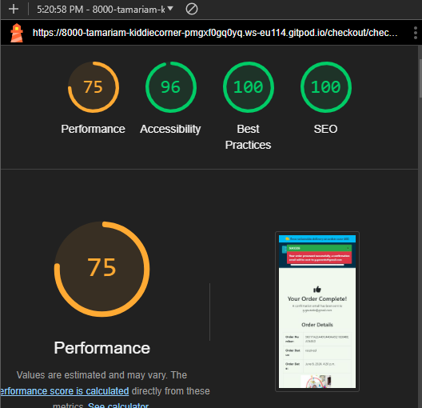

## Favourites Page 

  
lighthouse-Testing-Favourites-Desktop(click to expand)

  
lighthouse-Testing-Favourites-Mobile(click to expand)

## Contact Page

  
lighthouse-Testing-contact-page-Mobile(click to expand)

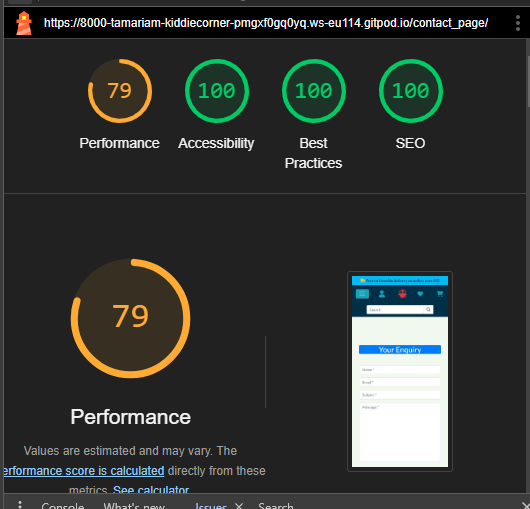

  
lighthouse-Testing-contact-page-Desktop(click to expand)

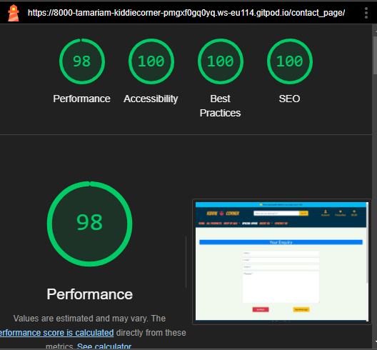

## Testimonials

  
lighthouse-Testing-Testimonials-page-Desktop(click to expand)

  
lighthouse-Testing-Testimonials-page-Mobile(click to expand)

## Profile

  
lighthouse-Testing-Profile-page-Mobile(click to expand)

  
lighthouse-Testing-Profile-page-Desktop(click to expand)

## Product Management

  
lighthouse-Testing-Add-product-page-Desktop(click to expand)

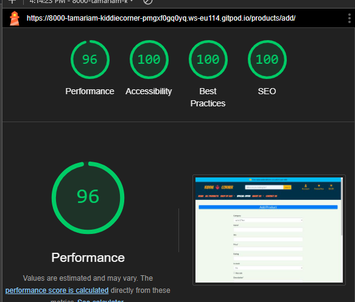

  
lighthouse-Testing-Edit-product-page-Mobile(click to expand)

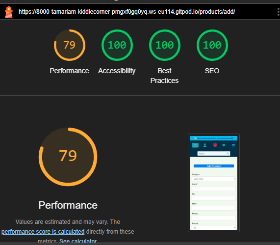

  
lighthouse-Testing-edit-product-page-Desktop(click to expand)

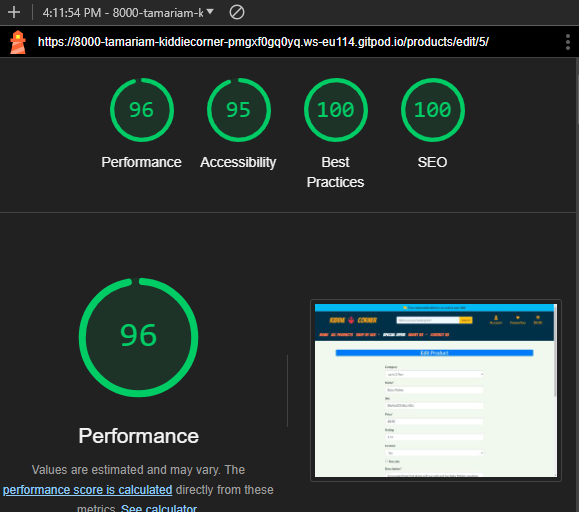

  
lighthouse-Testing-edit-product-page-Mobile(click to expand)

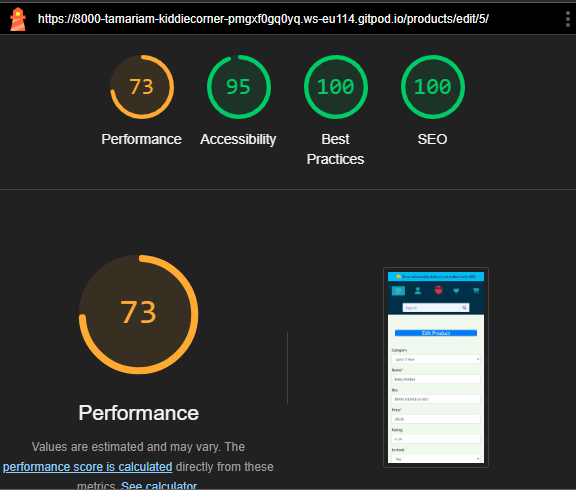

  
lighthouse-Testing-edit-product-page-Desktop(click to expand)

## Account Managemen

  
lighthouse-Testing-SignUp-page-Desktop(click to expand)

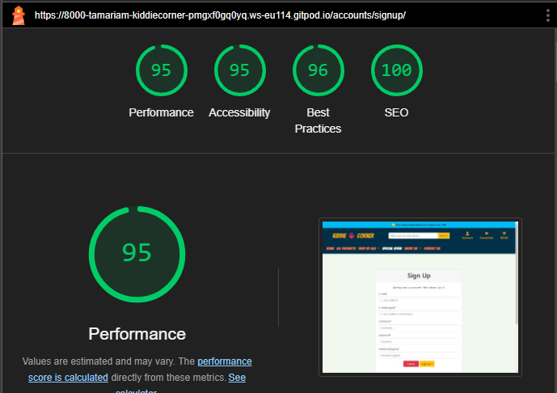

  
lighthouse-Testing-SignUp-page-Mobile(click to expand)

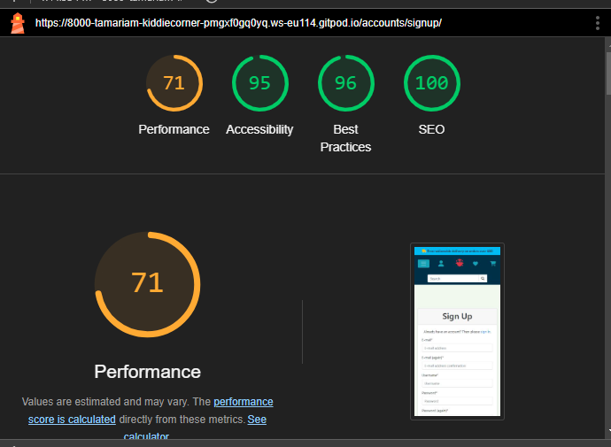

  
lighthouse-Testing-logout-page-Desktop(click to expand)

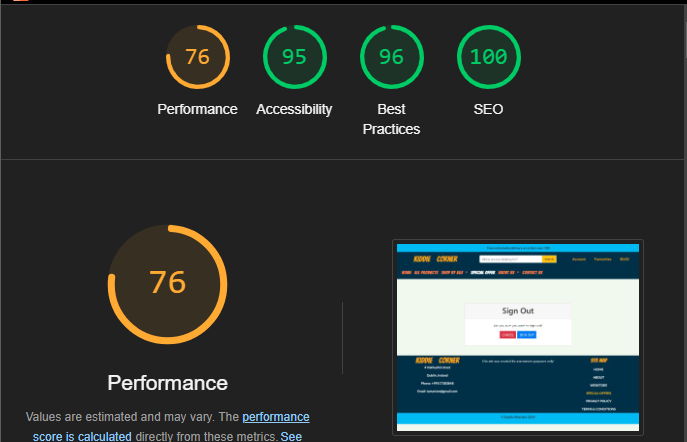

  
lighthouse-Testing-logout-page-Mobile(click to expand)

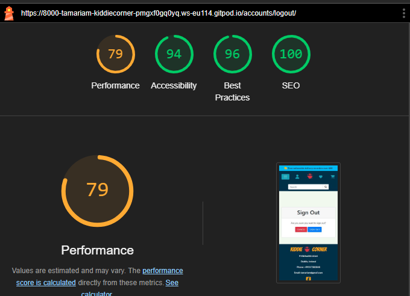

  
lighthouse-Testing-login-page-Desktop(click to expand)

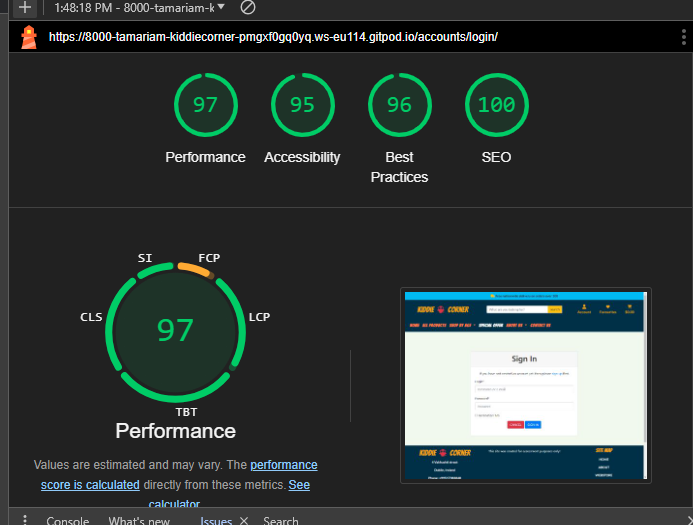

  
lighthouse-Testing-login-page-Mobile(click to expand)

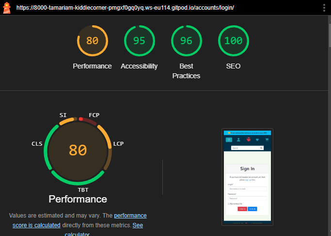

### Validator Testing

- HTML

  -During validation [W3C HTML Validator](https://validator.w3.org/) a few problems were presented in different html files but after correcting the relevant issues, no warnings or errors were shown.All pages are validated.This problemss are mentioned in Bugs section.

  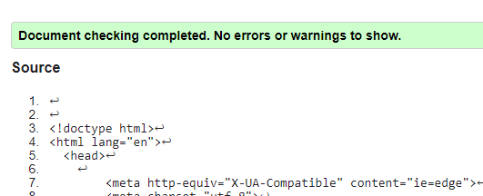

- CSS

  - No errors were found when passing through the official [W3C CSS Validator](https://jigsaw.w3.org/css-validator/) validator.

  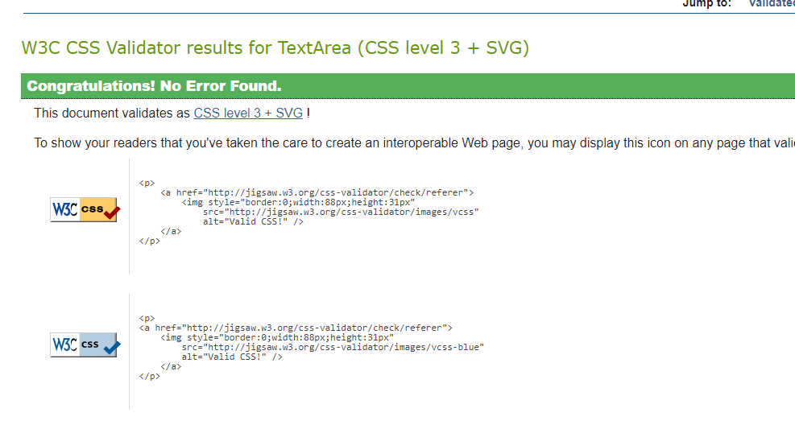

- Js

  - No errors were found when final passing through the official  [JSHint](https://jshint.com/) validator.

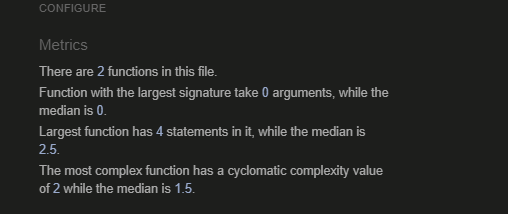

- PEP8:
The only error I can not fix was in settings.py with AUTH_PASSWORD_VALIDATORS .

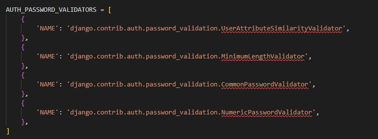

I tried to solve this issue but Django seems to think shortening these lines is ill advisable. For this reason, I left them to be longer than 80 characters.All final python files presented no warnings or errors.more about python validator errors in fixed bugs section.

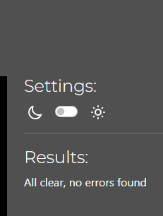

### Browser Compatibility

The site was tested on the following browsers and the appearance, functionality and, responsiveness were consistent throughout.

- Google Chrome
- Mozila firefox
- Microsoft Edge
- Safari

## Bugs 

### Fixed Bugs

#### HTML:

During the HTML validation process, several errors were identified and resolved:

- Error: Unclosed [div] Tags:

Issue: The validation flagged unclosed [div] tags, which occurred due to reusing code blocks without removing unnecessary [div] tags.
Resolution: The error was resolved by carefully reviewing and removing redundant [div] tags.

- Error: Opening Tags Without Closing Tags:

Issue: The validation detected opening tags without corresponding closing tags. This happened when a block of code was deleted, inadvertently removing a necessary closing [div] tag.
Resolution: The error was resolved by reinstating the deleted closing [div] tag.

- Error: Start Tag p Seen in Table

Issue: The validation reported an error when a [p] tag was inadvertently placed inside a [table] element.
Resolution: After recognizing the mistake, the [p] tag was moved outside the [table] tag, resolving the error.

- Error: Element p not allowed as child of element strong:
Issue: The error was  occured during toast-success.html  validation process.
resolution: I placed element strong inside element p to maintain block-level structure and avvoid error .

#### Python

During the Python code validation process, the following warnings were identified and promptly resolved:

* Issue: Blank spaces were detected within the code.
Resolution: Extra blank spaces were removed from the codebase, ensuring cleaner and more consistent formatting.
* Issue: Trailing spaces were present at the end of lines in the code.
Resolution: Trailing spaces were eliminated from the code, enhancing readability and adhering to coding standards.
* Issue: Some lines in the code exceeded the recommended maximum line length.
Resolution: Long lines were refactored or split into shorter segments.

####  Functrionality testing

 
1. Issue:
- When i was trying to add  a product to the shopping bag, the success message is displayed multiple times. For example, when adding the second product, the success message appears twice, for the third product, it appears three times, and so on. 
The issue was due to incorrect template logic that caused the success message div to be duplicated. The template logic was updated to ensure that the success message is displayed only once when a product is added to the shopping bag. The content of the message is now updated accordingly without duplicating the success message div.
2. Issue:
- I encountered a FieldError in the Order model while attempting to specify the "date" field in the order model form. The issue arose from the fact that the "date" field was registered as a read-only field in the admin panel configuration.
To resolve this issue, I modified the admin panel configuration to remove the "date" field from the list of read-only fields. By allowing the "date" field to be editable from the admin interface, the FieldError was resolved. 
3. Issue:
- When attempting to access the favorites or profile page from a different browser or window, a server error occurred because these pages are only accessible to authenticated users. To resolve this issue, the login_required decorator was added to the views handling these pages. However, this solution now requires users to log in again every time they attempt to access the links in a new browser or window.
4. Issue 
- After reviewing the Stripe webhook status, it was discovered that the status returned was 400 instead of 200, even though the payment was confirmed. The root cause of this issue was identified as a typo in the code. Instead of using the correct method save_info  save-info was mistakenly used, leading to the unexpected status code.
5. Issue
- Also In the handle_payment_intent_succeeded view, there were several mistakes in the field definitions, including typos and incorrect field names. After addressing these issues, the webhook handler status was successfully changed to 200.
## Deployment Issues
1. Issue:
After the initial deployment, it was noticed that no static files were collected from Heroku, resulting in an unattractive appearance of the site.Site was unrecognizable. After spending hours investigating the issue and seeking assistance from tutoring support, two issues were identified as the root cause of the problem:
 - DEBUG set to 'DEVELOPMENT' in os.environ in the settings file, but the variable was not defined in environ. This prevented Heroku from collecting static files.
 - During the AWS setup, the step where the bucket policy needed to be updated was skipped.
After addressing these issues, the site deployed without any problem.
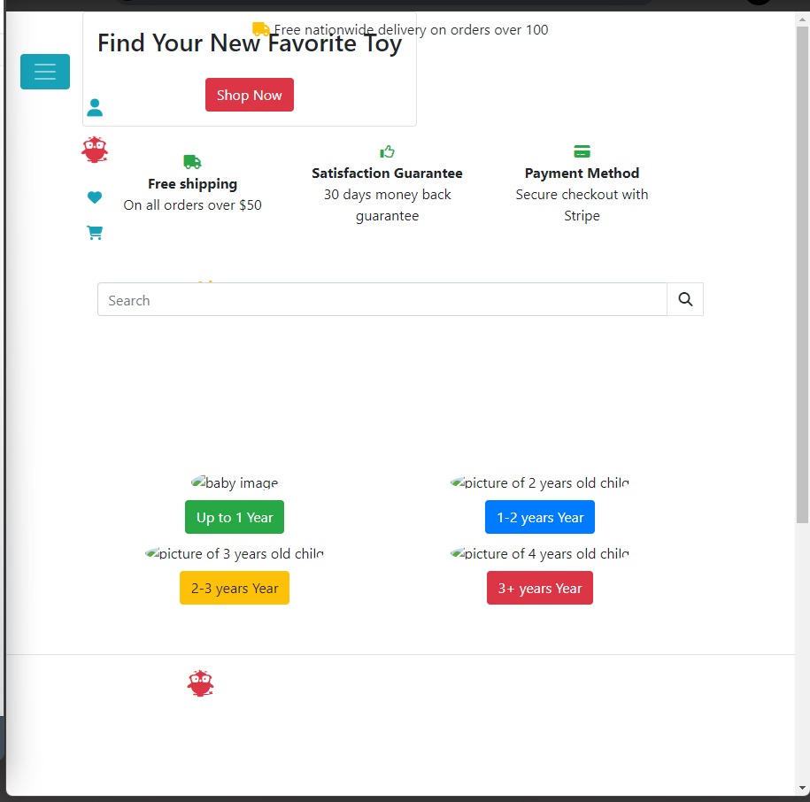

2. Issue:
- After successfully deploying the page, it was observed that the products and testimonials pages were completely empty. This issue arose because the products and testimonials were not loaded into the virtual database during the initial setup. Upon realization of this oversight, the loaddata command was executed to populate the database with the necessary data.
- Furthermore, it was noticed that media files were not uploaded to AWS, which also contributed to the issue. After uploading the media files to AWS, the products and testimonials pages functioned as expected without any further issues.
3. Issue: 
- During testing of the deployed site, it was discovered that after registering, no emails were being sent to users, and users were automatically being registered as administrators. Upon investigating the email configurations, everything appeared to be set up correctly. After a lengthy investigation, it was realized that there was no runtime file for Python's version present.

This absence of a runtime file for Python's version was causing the issue with email sending and user registration. Once the runtime file was added, the email functionality and user registration worked as expected.

### Unfixed Bugs

There is no unfixed bugs.

[Back to Readme](README.md)

