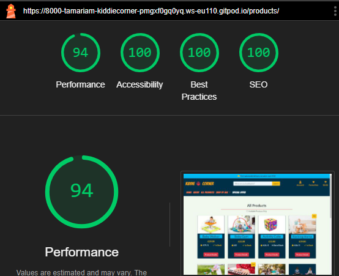
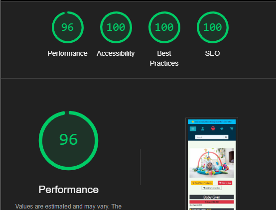
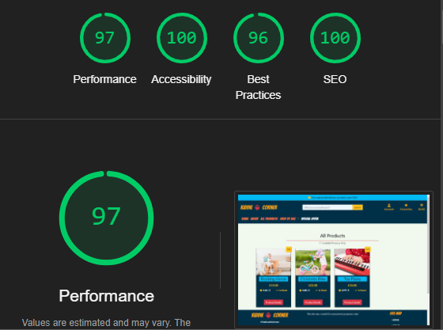
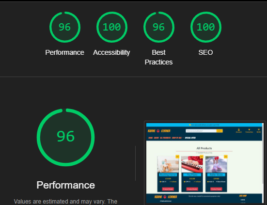
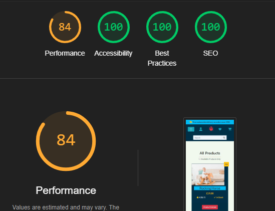
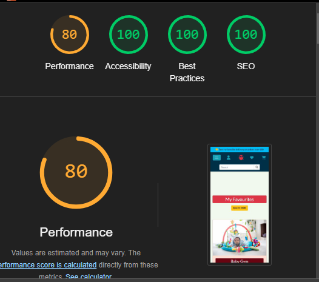

- [Manual Testing](#manual-testing)
- [lighthouse Testing](#lighthouse-testing)
- [validator testing](#validation-testing)
- [Bugs](#bugs)
  - [fixed Bugs](#fixed-bugs)
  - [Unfixed Bugs](#unfixed-bugs)

# Testing
## Lighthouse

### Lighthouse testing

[Chrome DevTools Lighthouse](https://developers.google.com/web/tools/lighthouse) was used to test:

* Performance
* Accessibility
* Best Practices
* SEO.

Below are the Lighthouse test results for all pages

## Home Page

  
lighthouse-Testing-Home-Desktop (click to expand)

  
lighthouse-Testing-Home-Mobile (click to expand)

## All Products page

  
lighthouse-testing-Allproducts-desktop (click to expand)

  
lighthouse-Testing-AllProducts-Mobile (click to expand)

## Product Details

  
lighthouse-Testing-product-details-Desktop (click to expand)

  
lighthouse-Testing-product-details-mobile (click to expand)

## product category 

  
lighthouse-Testing-shop-by-age-desktop (click to expand)

  
lighthouse-Testing-shop-by-age-mobile (click to expand)

  
lighthouse-Testing-special-offers-Desktop (click to expand)

  
lighthouse-Testing-special-offers-Mobile (click to expand)

## Shopping Bag

  
lighthouse-Testing-shopping-bag-Mobile (click to expand)

  
lighthouse-Testing-shopping-bag-Mobile (click to expand)

  
lighthouse-Testing-Empty-Bag-Desktop (click to expand)

  
lighthouse-Testing-Empty-Bag-Mobile (click to expand)

## Checkout Page

  
lighthouse-Testing-checkout-page-Desktop (click to expand)

  
lighthouse-Testing-checkout-page-Mobile (click to expand)

  
lighthouse-Testing-checkout-success-desktop (click to expand)

  
lighthouse-Testing-checkout-success-Mobile (click to expand)

## Favourites Page 

  
lighthouse-Testing-Favourites-Desktop(click to expand)

  
lighthouse-Testing-Favourites-Mobile(click to expand)

## Contact Page

  
lighthouse-Testing-contact-page-Mobile(click to expand)

  
lighthouse-Testing-contact-page-Desktop(click to expand)

## Testimonials

  
lighthouse-Testing-Testimonials-page-Desktop(click to expand)

  
lighthouse-Testing-Testimonials-page-Mobile(click to expand)

## Profile

  
lighthouse-Testing-Profile-page-Mobile(click to expand)

  
lighthouse-Testing-Profile-page-Desktop(click to expand)

## Product Management

  
lighthouse-Testing-Add-product-page-Desktop(click to expand)

  
lighthouse-Testing-Edit-product-page-Mobile(click to expand)

  
lighthouse-Testing-edit-product-page-Desktop(click to expand)

  
lighthouse-Testing-edit-product-page-Mobile(click to expand)

  
lighthouse-Testing-edit-product-page-Desktop(click to expand)

## Account Managemen

  
lighthouse-Testing-SignUp-page-Desktop(click to expand)

  
lighthouse-Testing-SignUp-page-Mobile(click to expand)

  
lighthouse-Testing-logout-page-Desktop(click to expand)

  
lighthouse-Testing-logout-page-Mobile(click to expand)

  
lighthouse-Testing-login-page-Desktop(click to expand)

  
lighthouse-Testing-login-page-Mobile(click to expand)

### Validator Testing

- HTML

  -During validation [W3C HTML Validator](https://validator.w3.org/) a few problems were presented in different html files but after correcting the relevant issues, no warnings or errors were shown.All pages are validated.This problemss are mentioned in Bugs section.

  

- CSS

  - No errors were found when passing through the official [W3C CSS Validator](https://jigsaw.w3.org/css-validator/) validator.

  

- Js

  - No errors were found when final passing through the official  [JSHint](https://jshint.com/) validator.

- PEP8:
The only error I can not fix was in settings.py with AUTH_PASSWORD_VALIDATORS .

I tried to solve this issue but Django seems to think shortening these lines is ill advisable. For this reason, I left them to be longer than 80 characters.All final python files presented no warnings or errors.more about python validator errors in fixed bugs section.

### Browser Compatibility

The site was tested on the following browsers and the appearance, functionality and, responsiveness were consistent throughout.

- Google Chrome
- Mozila firefox
- Microsoft Edge
- Safari

## Bugs 

### Fixed Bugs

#### HTML:

During the HTML validation process, several errors were identified and resolved:

- Error: Unclosed [div] Tags:

Issue: The validation flagged unclosed [div] tags, which occurred due to reusing code blocks without removing unnecessary [div] tags.
Resolution: The error was resolved by carefully reviewing and removing redundant [div] tags.

- Error: Opening Tags Without Closing Tags:

Issue: The validation detected opening tags without corresponding closing tags. This happened when a block of code was deleted, inadvertently removing a necessary closing [div] tag.
Resolution: The error was resolved by reinstating the deleted closing [div] tag.

- Error: Start Tag p Seen in Table

Issue: The validation reported an error when a [p] tag was inadvertently placed inside a [table] element.
Resolution: After recognizing the mistake, the [p] tag was moved outside the [table] tag, resolving the error.

- Error: Element p not allowed as child of element strong:
Issue: The error was  occured during toast-success.html  validation process.
resolution: I placed element strong inside element p to maintain block-level structure and avvoid error .

#### Python

During the Python code validation process, the following warnings were identified and promptly resolved:

* Issue: Blank spaces were detected within the code.
Resolution: Extra blank spaces were removed from the codebase, ensuring cleaner and more consistent formatting.
* Issue: Trailing spaces were present at the end of lines in the code.
Resolution: Trailing spaces were eliminated from the code, enhancing readability and adhering to coding standards.
* Issue: Some lines in the code exceeded the recommended maximum line length.
Resolution: Long lines were refactored or split into shorter segments.

####  Functrionality testing

 
1. Issue:
- When i was trying to add  a product to the shopping bag, the success message is displayed multiple times. For example, when adding the second product, the success message appears twice, for the third product, it appears three times, and so on. 
The issue was due to incorrect template logic that caused the success message div to be duplicated. The template logic was updated to ensure that the success message is displayed only once when a product is added to the shopping bag. The content of the message is now updated accordingly without duplicating the success message div.
2. Issue:
- I encountered a FieldError in the Order model while attempting to specify the "date" field in the order model form. The issue arose from the fact that the "date" field was registered as a read-only field in the admin panel configuration.
To resolve this issue, I modified the admin panel configuration to remove the "date" field from the list of read-only fields. By allowing the "date" field to be editable from the admin interface, the FieldError was resolved. 
3. Issue:
- When attempting to access the favorites or profile page from a different browser or window, a server error occurred because these pages are only accessible to authenticated users. To resolve this issue, the login_required decorator was added to the views handling these pages. However, this solution now requires users to log in again every time they attempt to access the links in a new browser or window.
4. Issue 
- After reviewing the Stripe webhook status, it was discovered that the status returned was 400 instead of 200, even though the payment was confirmed. The root cause of this issue was identified as a typo in the code. Instead of using the correct method save_info  save-info was mistakenly used, leading to the unexpected status code.
5. Issue
- Also In the handle_payment_intent_succeeded view, there were several mistakes in the field definitions, including typos and incorrect field names. After addressing these issues, the webhook handler status was successfully changed to 200.
## Deployment Issues
1. Issue:
After the initial deployment, it was noticed that no static files were collected from Heroku, resulting in an unattractive appearance of the site.Site was unrecognizable. After spending hours investigating the issue and seeking assistance from tutoring support, two issues were identified as the root cause of the problem:
 - DEBUG set to 'DEVELOPMENT' in os.environ in the settings file, but the variable was not defined in environ. This prevented Heroku from collecting static files.
 - During the AWS setup, the step where the bucket policy needed to be updated was skipped.
After addressing these issues, the site deployed without any problem.

2. Issue:
- After successfully deploying the page, it was observed that the products and testimonials pages were completely empty. This issue arose because the products and testimonials were not loaded into the virtual database during the initial setup. Upon realization of this oversight, the loaddata command was executed to populate the database with the necessary data.
- Furthermore, it was noticed that media files were not uploaded to AWS, which also contributed to the issue. After uploading the media files to AWS, the products and testimonials pages functioned as expected without any further issues.
3. Issue: 
- During testing of the deployed site, it was discovered that after registering, no emails were being sent to users, and users were automatically being registered as administrators. Upon investigating the email configurations, everything appeared to be set up correctly. After a lengthy investigation, it was realized that there was no runtime file for Python's version present.

This absence of a runtime file for Python's version was causing the issue with email sending and user registration. Once the runtime file was added, the email functionality and user registration worked as expected.

### Unfixed Bugs

There is no unfixed bugs.

[Back to Readme](README.md)

